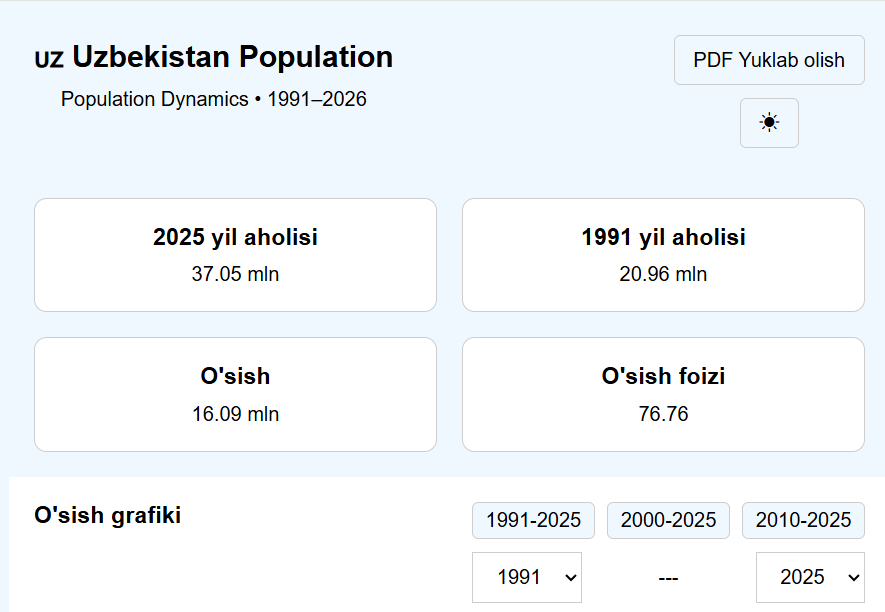
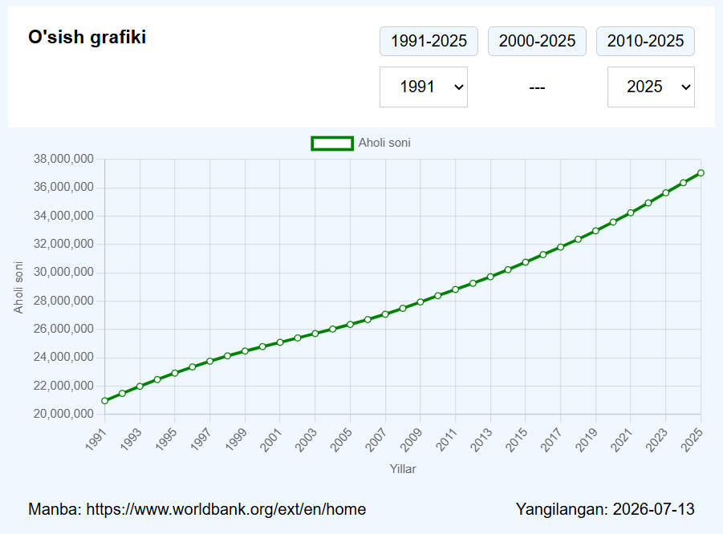

# Uzbekistan Population Dashboard

O‘zbekiston aholisining 1991-yildan 2025-yilgacha bo‘lgan o‘sish dinamikasini vizualizatsiya qiluvchi React web-ilova.

## Features

* 1991–2025 yillar bo‘yicha aholi statistikasi
* Population growth Line Chart
* Initial Population
* Current Population
* Total Growth
* Growth %
* Yillar bo‘yicha period filtering
* Responsive dashboard
* Mock API orqali ma’lumot olish
* A4 formatida PDF export
* Loading, Error va Empty states

## Technologies

* React
* Vite
* JavaScript
* Recharts
* JSON Server
* html2canvas
* jsPDF
* CSS

## Installation

Repository'ni clone qiling:

```bash
git clone https://github.com/KabirovElmurod/UzbekistanPopulation.git
```

Project papkasiga kiring:

```bash
cd UzbekistanPopulation
```

Dependencies'larni o‘rnating:

```bash
npm install
```

## Running the project

Frontend'ni ishga tushirish:

```bash
npm run dev
```

Mock API serverni alohida terminalda ishga tushiring:

```bash
npm run mock
```

Mock API:

```text
http://localhost:3001
```

## Mock API

Ilova real backend o‘rniga JSON Server orqali Mock API'dan foydalanadi.

Population ma’lumotlari:

```text
GET http://localhost:3001/population
```

## PDF Export

Dashboard'dagi **PDF yuklab olish** tugmasi orqali statistikalar va diagramma A4 formatdagi PDF faylga eksport qilinadi.

Fayl nomi:

```text
uzbekistan-population-1991-2026.pdf
```

## Project Structure

```text
src/
├── components/
├── style/
├── utils/
├── App.jsx
├── main.jsx
└── index.css

mock/
└── db.json
```

## Preview



